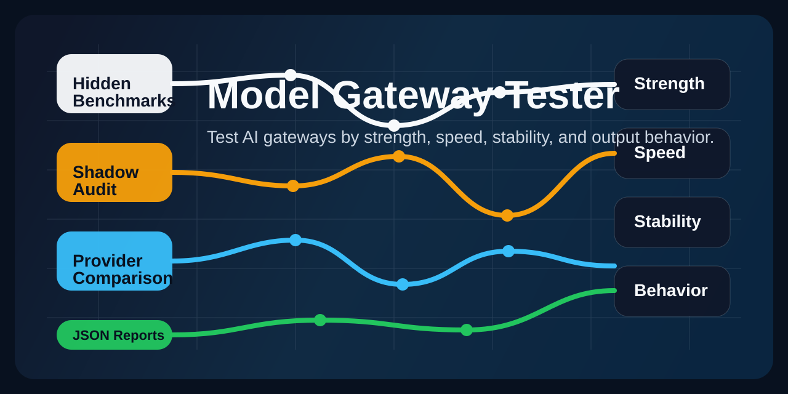

# Model Gateway Tester

Compare AI model gateways in the most direct way:

- Which route is stronger?
- Which route is faster?
- Which route is more stable?
- Which route really behaves like the model it claims to serve?

`Model Gateway Tester` is a practical testing tool for comparing model gateways side by side with hidden dynamic tasks and short-cycle shadow audit runs.

It is also built for one very practical purpose: checking whether a third-party model gateway is quietly swapping models, lowering quality, cheating, or misleading users.

## What It Does

- generates fresh private benchmark questions by default
- compares multiple providers under the same output budget
- supports short-cycle shadow audit using your own prompts
- tracks completion rate, accuracy, latency, and reasoning-token behavior
- writes a JSON report for later comparison

## Why This Exists

Public benchmark questions are easy to recognize.

This project focuses on harder-to-fake evaluation:

- hidden dynamic tasks
- random fresh seeds by default
- side-by-side route comparison
- output behavior, not just one lucky answer

## Good For

- comparing OpenRouter vs Longent vs Fireworks
- checking whether a third-party route feels weaker than expected
- testing whether a provider becomes unstable under harder reasoning tasks
- deciding which route should be your default production choice

## Current Support

- OpenRouter Responses API
- Longent Responses-compatible gateway
- Fireworks Responses-compatible route

## Quick Start

Python 3.11+ is recommended.

```bash
python3 -m py_compile model_gateway_tester.py
```

Run a default hard audit:

```bash
python3 model_gateway_tester.py \
  --openrouter-key "YOUR_OPENROUTER_KEY"
```

Run a three-way comparison:

```bash
python3 model_gateway_tester.py \
  --openrouter-key "YOUR_OPENROUTER_KEY" \
  --fireworks-key "YOUR_FIREWORKS_KEY"
```

Override the Longent route:

```bash
python3 model_gateway_tester.py \
  --openrouter-key "YOUR_OPENROUTER_KEY" \
  --fireworks-key "YOUR_FIREWORKS_KEY" \
  --longent-model "gpt-5.4(xhigh)"
```

Reproduce the same benchmark set:

```bash
python3 model_gateway_tester.py \
  --seed 123456 \
  --openrouter-key "YOUR_OPENROUTER_KEY"
```

## Example: Compare Three Routes

This is the most common command:

```bash
python3 model_gateway_tester.py \
  --openrouter-key "YOUR_OPENROUTER_KEY" \
  --fireworks-key "YOUR_FIREWORKS_KEY" \
  --longent-model "gpt-5.4-fast(xhigh)"
```

What it gives you:

- who finishes more tasks
- who answers more tasks correctly
- who is faster
- who burns more reasoning tokens
- who behaves differently from the baseline

## Shadow Audit Mode

You can also use your own prompts:

```bash
python3 model_gateway_tester.py \
  --openrouter-key "YOUR_OPENROUTER_KEY" \
  --prompt-file prompts.jsonl \
  --shadow-sample-size 30 \
  --tasks-per-family 0
```

Supported prompt file formats:

- `.jsonl`
- `.json`
- `.txt`
- `.md`

Example JSONL rows:

```json
{"id":"p1","prompt":"Summarize this article"}
{"id":"p2","prompt":"Find the bug in this Python code"}
{"id":"p3","prompt":"Return strict minified JSON","expected":"{\"ok\":true}"}
```

## Default Settings

The defaults are tuned for stronger audits:

- `difficulty=very-hard`
- `tasks_per_family=10`
- `max_output_tokens=1024`
- fresh random seed every run unless you pass `--seed`

If you want a stronger separator for top-tier models, use `very-hard`:

```bash
python3 model_gateway_tester.py \
  --difficulty very-hard \
  --tasks-per-family 5
```

Use this mode when too many providers still cluster at the top on regular hard runs.

## Output

Every run writes a JSON report.

The report includes:

- per-provider summary
- per-family breakdown
- row-level results
- comparison metrics versus the baseline provider

Prompt text is excluded by default. Only prompt hashes are stored unless you explicitly enable prompt capture.

## Security Notes

- never commit API keys
- pass keys through CLI flags or your own secure local setup
- keep `--include-prompt-text` off unless you really need raw prompt storage

## Chinese Summary

`Model Gateway Tester` 是一个用来比较模型网关质量的工具。

它最适合做这几件事：

- 比较第三方模型路线到底强不强
- 看它稳不稳、快不快
- 看它到底像不像它宣称的那个模型
- 用同一批隐藏题，把不同网关放在同一张表里比较
- 检查第三方中转 API 有没有偷偷换模型、降配、挂羊头卖狗肉，或者欺骗用户

一句话：

它不是模型本身，而是一个“模型网关测试器”。

## License

MIT
